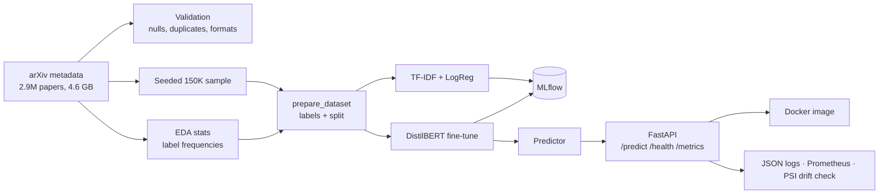

# arXiv Paper Classifier

[](https://github.com/Gaurang-Verse/arxiv-paper-classifier/actions/workflows/ci.yml)

Give it a paper's title and abstract, and it predicts which arXiv subject
categories the paper belongs to. A paper can belong to several at once, for
example `cs.LG` and `stat.ML`, so this is multi-label classification over 172
categories.

I built this as an end-to-end ML engineering project rather than a notebook
demo. It covers data validation, a baseline, a fine-tuned transformer,
experiment tracking, a tested inference layer, a REST API, a Docker image, CI,
and monitoring. The model itself is deliberately modest (DistilBERT). Most of
the work went into making each step reproducible and making sure every number
below was actually measured.

## Results

All models were trained and compared on the same 120,000 / 15,000 / 15,000
train / validation / test split of a 150,000-paper random sample.

| Model | Split | Threshold | Micro-F1 | Macro-F1 |
|---|---|---|---|---|
| TF-IDF + logistic regression (baseline) | validation | 0.50 | 0.471 | 0.210 |
| DistilBERT, 20K training rows | validation | 0.50 | 0.225 | 0.026 |
| DistilBERT, full 120K training rows | validation | 0.50 | 0.548 | 0.228 |
| DistilBERT, full 120K training rows | validation | 0.20 | 0.593 | 0.323 |
| **DistilBERT, full 120K training rows** | **test** | **0.20** | **0.596** | **0.323** |

The last row is the headline number. The 0.20 threshold was fixed on
validation first, and the test split was scored exactly once, at the end.
Test and validation agree to within 0.003.

Micro-F1 is dominated by common categories like `cs.LG` and `hep-ph`.
Macro-F1 weights all 172 categories equally, so it shows how the model does on
the long tail. The gap between the two is the main weakness of every model
here (more on that under [Limitations](#limitations)).

Full write-ups: [baseline](docs/baseline_results.md) ·
[transformer and test set](docs/transformer_results.md) ·
[monitoring](docs/monitoring.md)

## Things that went wrong, and what they taught me

Some of the most useful parts of this project were results that looked wrong.

**The transformer first lost to the baseline, badly.** Trained on a
20,000-row subsample on my laptop, DistilBERT scored a macro-F1 of 0.026
against the baseline's 0.210. After its first epoch, not a single label
cleared the 0.5 cutoff. Rather than write it up as "transformers don't help
here", I saved the model and swept the decision threshold over its raw
outputs. There were two separate problems. First, a fixed 0.5 cutoff is badly
calibrated for 172 independent sigmoids: the model's probabilities were
systematically low, and just lowering the threshold on the same trained model
raised macro-F1 4.6x (0.026 to 0.120). Second, even at its best threshold the
model still lost, because 20K rows is too little signal per label. Retraining on the full 120K
rows (on a free Colab T4, about 42 minutes) fixed both. Both runs are kept in
the repo, not just the good one.

**A drift monitor raised a false alarm on clean data.** My first
drift-detection script reported a Population Stability Index of 1.31, which
means "severe drift", on validation data that comes from the same distribution
as training. The method was wrong. It compared the model's *predictions* with
the *true* label frequencies (so model bias looked like drift), and it spread
a few hundred papers across 172 bins, most of them empty. The fixed version
compares predictions with predictions and pools rare categories into an
"other" bucket. It is also checked in both directions: 0.054 on a same-distribution
batch (correctly quiet) and 1.155 on a batch of maths papers (correctly
alarmed).

**Smaller things.** pandas read arXiv IDs like `0704.0001` as floats and
silently dropped the leading zero. PyYAML parses `2e-5` as a string, so the
learning rate crashed the optimizer. A too-strict regex flagged 21.6% of valid
category codes as malformed. Each of these was caught by checking the actual
output instead of assuming the step had worked.

## How it fits together



A few design decisions worth calling out:

- **One function defines the data for every model.** Both training scripts
  call `prepare_dataset()` in `pipeline.py`, so the baseline and the
  transformer are guaranteed to see identical splits. The whole model
  comparison depends on that, so it lives in one place rather than being
  copied into each script.
- **The label space comes from EDA, not from the training split.** The 172
  categories are the arXiv codes that appear at least 50 times in the full
  dataset. It is a vocabulary decided up front from label counts alone, not
  something learned from the relationship between text and labels.
- **The model loads once, and the label mapping is verified.** The API loads
  the model at startup. `Predictor` refuses to start if the model's output
  size doesn't match the label space, so a mismatched model and config can't
  silently return the wrong category names.
- **The raw file is streamed, never loaded whole.** Validation, EDA and
  sampling all read the 4.6 GB file in chunks. Sampling also checks the exact
  row count and fails loudly if the snapshot has changed.

## Project layout

```
src/arxiv_classifier/
  data/          validation, sampling, splitting, PyTorch dataset
  features/      label space + multi-hot encoding, text normalisation
  models/        baseline and DistilBERT builders
  pipeline.py    shared data preparation (single source of truth for splits)
  inference.py   Predictor: text in, categories out
  api.py         FastAPI app with request logging and Prometheus metrics
  tracking.py    MLflow helper
scripts/         entry points: sampling, training, evaluation, checks
configs/         every tunable value, one YAML per stage
tests/           28 unit and API tests (run in CI)
docs/            measured findings for each stage
notebooks/       EDA only; no training logic lives in notebooks
```

## Running it

Everything runs from the repo root with Python 3.11.

```bash
python -m venv venv && source venv/bin/activate
pip install -e ".[dev]"
```

**1. Get the data.** Download `arxiv-metadata-oai-snapshot.json` into
`data/raw/` (instructions in [docs/dataset.md](docs/dataset.md)).

**2. Validate, profile, sample.**

```bash
python -m arxiv_classifier.data.validation   # nulls, duplicate IDs, category format
python scripts/compute_eda_stats.py          # writes data/processed/eda_stats.json
python scripts/create_sample.py              # seeded 150K sample -> parquet
```

**3. Train.**

```bash
python scripts/train_baseline.py
python scripts/train_transformer.py configs/transformer_full.yaml   # a GPU is strongly recommended
```

Each run writes a results JSON to `data/processed/` and logs to MLflow. To
browse runs:

```bash
mlflow ui --backend-store-uri sqlite:///mlflow.db
```

**4. Evaluate on test (once).**

```bash
python scripts/evaluate_test_set.py
```

**5. Serve.**

```bash
uvicorn arxiv_classifier.api:app
```

```bash
curl -X POST http://127.0.0.1:8000/predict \
  -H "Content-Type: application/json" \
  -d '{"title": "A New Method for Solving the Navier-Stokes Equations",
       "abstract": "This paper presents a finite element method for numerically solving the incompressible Navier-Stokes equations."}'
```

This returns every category's probability plus the ones above the threshold,
here `["math.NA", "cs.NA"]`. You can pass `"threshold"` in the request body to
override the default of 0.20.

**Or with Docker:**

```bash
docker build -t arxiv-classifier-api .
docker run -p 8000:8000 arxiv-classifier-api
```

The image uses CPU-only PyTorch, runs as a non-root user, has a health check,
and makes no calls to the Hugging Face Hub at runtime. It copies the trained
model in from your local `data/processed/`, so you need to train (step 3)
before building.

**Tests and lint:**

```bash
pytest
ruff check src scripts tests
```

## Limitations

These are known and deliberate, not oversights I'm hiding.

- **Rare categories are still weak.** Macro-F1 of 0.32 means many of the 172
  categories are predicted poorly. The baseline scored F1 = 0 on 66 of them,
  mostly categories with very little data. Training on more of the 2.9M
  papers is the obvious fix.
- **A third of inputs get truncated.** `max_length=256` was chosen to keep
  training fast, but 34.1% of title + abstract inputs are longer than that
  (median 214 tokens, 90th percentile 355). Trying 512 is the first experiment
  I'd run next.
- **One training run per configuration.** Weight initialisation isn't seeded,
  there is no variance estimate across seeds, and there was no hyperparameter
  search.
- **This has not been deployed.** The API and Docker image have been run
  locally and respond correctly, but they have never served real users.
  Latency has not been benchmarked. Monitoring exposes metrics and has a
  validated drift check, but no Prometheus server scrapes it and nothing
  alerts on it.
- **CI tests and lints but doesn't build the image.** The trained weights
  (250 MB) are kept out of git on purpose, so a CI runner has nothing to copy.
  A real setup would pull the model from a registry or object store at build
  time.
- **The test comparison covers the transformer only.** The baseline model was
  never saved, so the baseline is compared on validation only.

## Data and credits

Paper metadata is from arXiv via the
[Kaggle arXiv dataset](https://www.kaggle.com/datasets/Cornell-University/arxiv).
arXiv releases its metadata under
[CC0 1.0](https://info.arxiv.org/help/license/index.html). Only titles,


## License

Code is MIT licensed (see LICENSE). Dataset metadata is CC0 1.0 — see docs/dataset.md.
abstracts and category codes are used. No full texts. Thanks to arXiv for
making it openly available.

Built by Gaurang Kumbhar.
